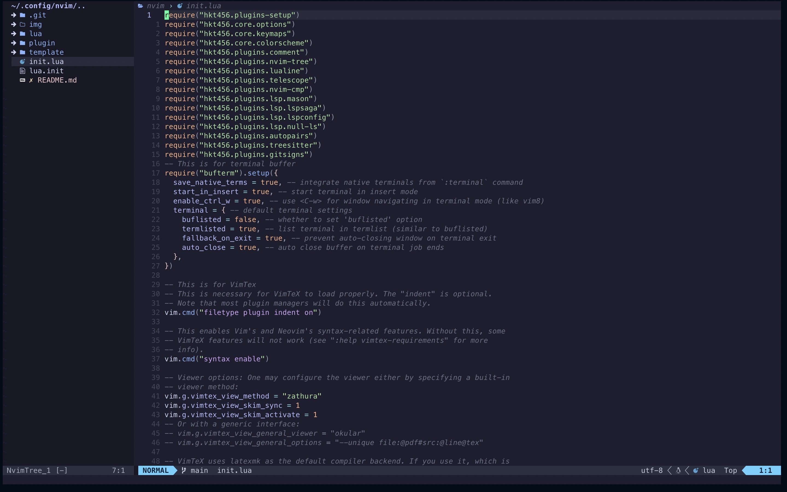

<div align="center">

NeoVIM Setup Files and Developer Setups

</div>

## Information



- OS: MacOS
- Shell: [zsh](https://www.zsh.org/)
- Editor: [neovim](https://neovim.io/)
- Browser: [operaGX](https://www.opera.com/gx/gx-browser?utm_id=CjwKCAiAgeeqBhBAEiwAoDDhn_eHh9VMmXe2zlRa4Bo4DkC04Fn9qFW6Oeg5JOSM_sjyAcb7UtZoYBoCFwkQAvD_BwE&utm_medium=pa&utm_source=google&utm_campaign=OGX_SEA_Search_EN_T1_Brand_V2&utm_content=636026705999&gad_source=1&gclid=CjwKCAiAgeeqBhBAEiwAoDDhn_eHh9VMmXe2zlRa4Bo4DkC04Fn9qFW6Oeg5JOSM_sjyAcb7UtZoYBoCFwkQAvD_BwE)
- Colorscheme: [catppuccin](https://github.com/catppuccin/catppuccin)
- Zathura: [zathura](https://pwmt.org/projects/zathura/)

### Features

- ✨ Minimal and aesthetic Catppuccin theme for Text Editor
- 🗨️ Lightweight and powerful ZSH shell
- 🚀 Functional developer environment for
  - C++ and C
  - Python
  - Nodejs
  - Vanilla Website Development
  - Machine Learning and Artificial Intelligence
  - Markdown and LaTeX Scripting
  - Zathura Document Viewer

### Plans

- I currently have no plans for its improvements

### Installations

```Bash
git clone --depth=1 https://github.com/hkt456/nvim-setup
cd nvim-setupt

cp -rp .config .Xresources ~

```

# License

This project is licensed under the [GPL-3.0 license](LICENSE).
